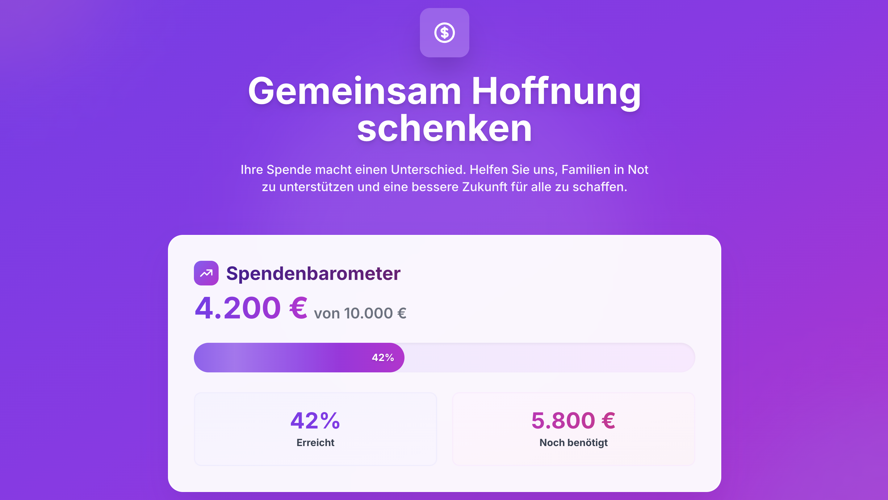
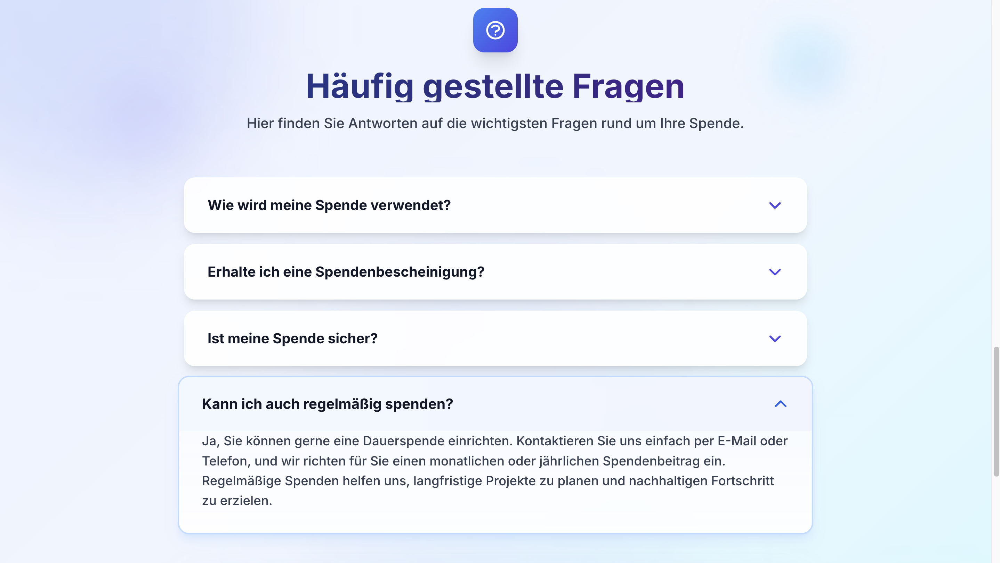
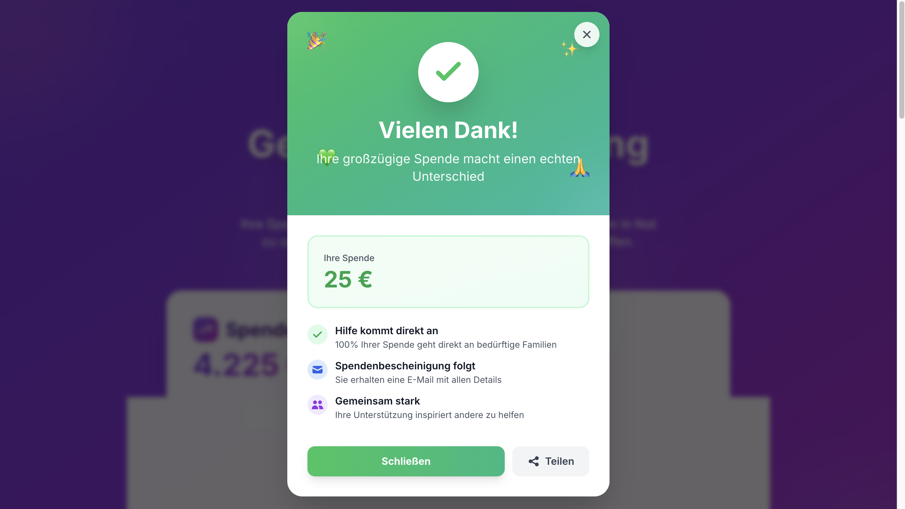
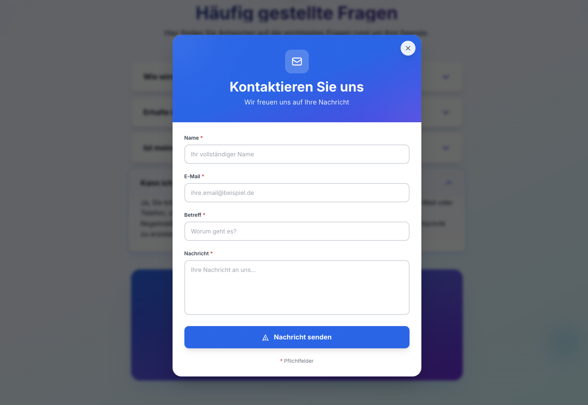
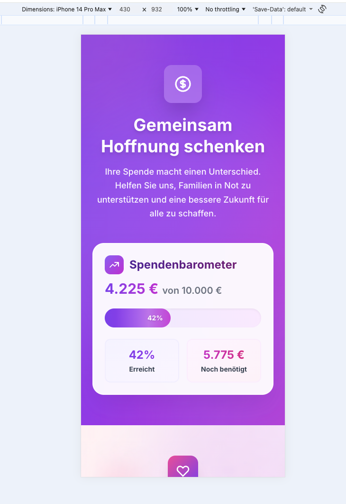
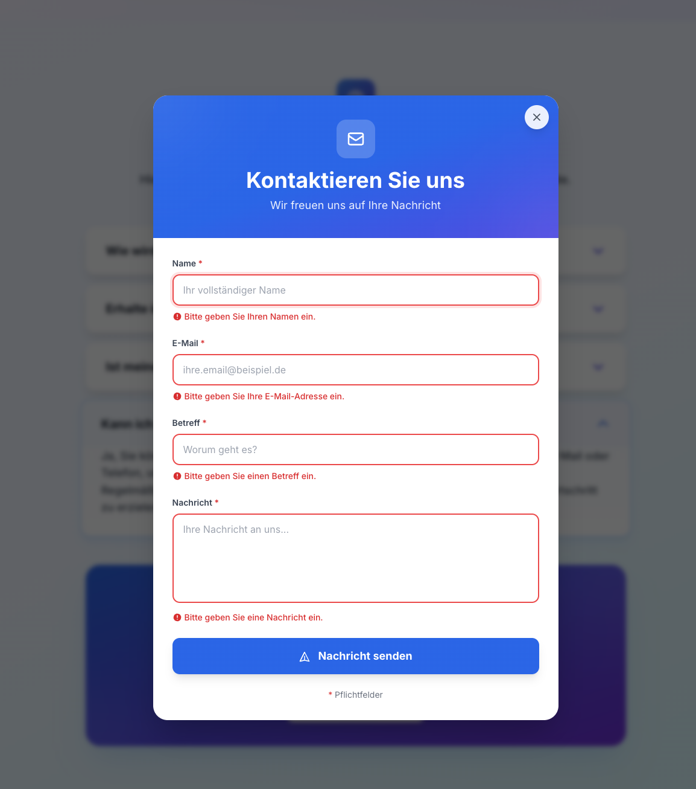

# Spenden-Landingpage für Hilfsorganisation

Eine interaktive One-Page-Anwendung für eine fiktive Hilfsorganisation, entwickelt mit Vue.js 3 und Vite.

## 🚀 Demo

Die Anwendung kann lokal gestartet werden mit:

```bash
npm install
npm run dev
```

Die Anwendung läuft dann unter `http://localhost:5173`

## 📸 Screenshots

### Desktop-Ansicht

#### Hero-Section mit Spendenbarometer

*Der Hero-Bereich zeigt das animierte Spendenbarometer mit Fortschrittsbalken, aktuellem Stand und einem prominenten Call-to-Action Button.*

#### Spendenformular

*Das Spendenformular mit Quick-Amount-Buttons, Validierung und modernem Design.*

#### FAQ-Accordion

*Die FAQ-Sektion mit erweiterbaren Fragen und Kontaktformular-Option.*

#### Thank You Modal

*Der Erfolgs-Modal nach einer Spende mit Celebration-Animation und Social-Share-Option.*

#### Kontaktformular Modal

*Das Kontaktformular-Modal für direkte Anfragen.*

### Mobile-Ansicht

#### Mobile Hero & Formular

*Vollständig responsive Darstellung auf mobilen Geräten.*

### Formular-Validierung

*Inline-Validierung mit klaren Fehlermeldungen und visuellen Hinweisen.*

## 🛠 Tech-Stack & Entscheidungen

### Framework-Wahl: Vue.js 3 (Composition API)

**Begründung:**
- **Einfachheit & Lesbarkeit**: Vue bietet eine klare, intuitive Syntax, die den Code wartbar und verständlich macht
- **Composition API**: Ermöglicht bessere Code-Organisation und Wiederverwendbarkeit durch logische Gruppierung
- **Reaktivität**: Vue's reaktives System macht State-Management einfach und performant
- **Kleine Bundle-Größe**: Für eine Landing Page ist die geringe Größe ideal
- **Vite als Build-Tool**: Extrem schnelle Development-Experience mit Hot Module Replacement

### Styling: Tailwind CSS

**Begründung:**
- **Utility-First Approach**: Schnelle Entwicklung durch vorgefertigte Utility-Klassen
- **Konsistentes Design-System**: Built-in Design-Tokens sorgen für einheitliche Abstände, Farben und Typografie
- **Responsive Design**: Mobile-First Breakpoints machen responsives Design einfach
- **Performance**: PurgeCSS entfernt ungenutztes CSS automatisch für minimale Bundle-Größe
- **Wartbarkeit**: Keine CSS-Datei-Explosion, Styles direkt beim HTML
- **Customization**: Einfache Anpassung über `tailwind.config.js`

### Projekt-Struktur

```
src/
├── components/
│   ├── HeroSection.vue       # Hero + Spendenbarometer
│   ├── DonationForm.vue      # Spendenformular mit Validierung
│   └── FaqSection.vue        # FAQ-Accordion
├── data/
│   └── faq.json             # FAQ-Daten
├── App.vue                   # Haupt-Komponente
├── main.js                   # App-Einstiegspunkt
└── style.css                 # Globale Styles
```

## 💡 UX-Überlegungen

### 1. **Progressive Disclosure & Visuelle Hierarchie**
- **Hero-Bereich prominent**: Das Spendenbarometer ist sofort sichtbar und zeigt den Fortschritt visuell an
- **Animierter Fortschrittsbalken**: Shimmer-Effekt und sanfte Übergänge machen den Fortschritt erlebbar
- **Klare Call-to-Actions**: Der Spenden-Button ist deutlich hervorgehoben mit Hover-Effekten und Icons
- **Dekorative Elemente**: Subtile Hintergrund-Blasen im Hero-Bereich schaffen Tiefe ohne abzulenken
- **Gradient-Backgrounds**: Moderne Farbverläufe ziehen Aufmerksamkeit auf wichtige Bereiche

### 2. **Fehlerprävention & Hilfreiche Validierung**
- **Inline-Validierung**: Fehlermeldungen erscheinen direkt unter dem jeweiligen Feld mit Slide-In-Animation
- **Klare, verständliche Fehlermeldungen**: Statt "Invalid input" wird präzise erklärt, was falsch ist
  - Beispiel: "Der Mindestbetrag beträgt 5 €" statt "Amount too low"
- **Quick-Amount-Buttons**: Vordefinierte Beträge reduzieren Eingabefehler und beschleunigen den Prozess
- **Auto-Focus auf Fehler**: Bei Submit scrollt die Seite automatisch zum ersten Fehlerfeld
- **Visual Feedback**: 
  - Felder mit Fehlern bekommen einen roten Rahmen, Icon und Ring
  - Aktive Quick-Amount-Buttons sind deutlich hervorgehoben
  - Focus-States mit farbigen Ringen für bessere Accessibility
- **Error Icons**: Kleine Icons neben Fehlermeldungen erhöhen die Erkennbarkeit

### 3. **Instant Feedback & Positive Verstärkung**
- **Thank-You-Modal**: Wunderschöner Full-Screen-Modal nach Spende mit:
  - Grüner Gradient-Hintergrund mit Dekoration
  - Animiertes Erfolgs-Icon (Bounce-Animation)
  - Feier-Emojis (🎉 ✨ 💚 🙏)
  - Anzeige des gespendeten Betrags
  - Impact-Message mit Icons
  - Social-Share-Funktion
- **Live-Update des Barometers**: Die Spende wird sofort im Fortschrittsbalken sichtbar
- **Auto-Scroll zum Barometer**: Nach der Spende scrollt die Seite nach oben, um das Update zu zeigen
- **Smooth Animations**: Alle Übergänge sind sanft und nicht abrupt (fade-in/out, height transitions, scale effects)
- **Micro-Interactions**: 
  - Buttons haben Hover-Scale-Effekte
  - Loading-Spinner bei Submit
  - Herz-Icon im Spenden-Button für emotionale Verbindung
  - Accordion öffnet sich flüssig mit Height-Transition
  - Modal-Overlays mit Backdrop-Blur

### 4. **Mobile-First & Responsive Design**
- Alle Komponenten sind vollständig responsive
- Touch-freundliche Buttons und Formulare (min. 44px Höhe)
- Optimierte Schriftgrößen für mobile Geräte
- Grid-Layout passt sich automatisch an Bildschirmgrößen an

### 5. **Accessibility & Usability**
- Semantisches HTML (section, button, label)
- ARIA-Attribute für Screen Reader (aria-expanded, aria-controls)
- Keyboard-Navigation möglich
- Ausreichende Kontraste (WCAG 2.1 AA)
- Focus-States für alle interaktiven Elemente

## 🤖 KI-Tool-Nutzung

Dieses Projekt wurde mit Unterstützung von **GitHub Copilot** entwickelt:

### Eingesetzte Features:
- **Code-Generierung**: Basis-Komponenten-Struktur und Boilerplate-Code
- **CSS-Styling**: Vorschläge für moderne, responsive Layouts
- **Validierungs-Logik**: Unterstützung bei der Implementierung der Form-Validierung
- **Kommentare & Dokumentation**: Hilfe bei der Erstellung verständlicher Kommentare

### Manuell verfeinert:
- **UX-Design-Entscheidungen**: Farbschema, Animationen, Spacing
- **Validierungslogik**: Spezifische Error-Messages auf Deutsch
- **Komponenten-Architektur**: State-Management zwischen Komponenten
- **Accessibility-Optimierungen**: ARIA-Labels und Keyboard-Navigation

## ✨ Features

### 1. Hero + Spendenbarometer (Mit Tailwind CSS)
- ✅ **Visueller Fortschrittsbalken**: Animated shimmer effect mit Tailwind animations
- ✅ **Prozentuale und absolute Anzeige**: 4.200 € von 10.000 € mit großer, lesbarer Typografie
- ✅ **Stats Grid**: Zwei-spaltige Darstellung mit Progress % und Restbetrag
- ✅ **Live-Update**: Smooth transition bei neuen Spenden (700ms ease-out)
- ✅ **Premium Design**: 
  - Gradient-Background (Indigo → Purple)
  - Dekorative Glasmorphismus-Blasen
  - Backdrop-blur auf Barometer-Karte
  - Shadow-2xl für Tiefe
- ✅ **Vollständig responsive**: Von Mobile bis Desktop perfekt optimiert

### 2. Spendenformular (Enhanced mit Tailwind)
- ✅ **Name-Feld**: Pflichtfeld, min. 2 Zeichen, Focus-Ring in Primary-Color
- ✅ **E-Mail-Feld**: Pflichtfeld, Email-Regex-Validierung
- ✅ **Betrag-Feld**: 
  - Pflichtfeld, min. 5 €, max. 1.000.000 €
  - Euro-Symbol als Prefix
  - Entfernte Spinner-Buttons für cleanes Design
- ✅ **Quick-Amount-Buttons**: 
  - 5, 10, 25, 50, 100 € vorausgewählt
  - Active State mit Primary-Gradient
  - Hover-Scale-Effect (scale-105)
- ✅ **Newsletter-Checkbox**: Styled checkbox mit Tailwind Forms
- ✅ **Premium Validierung**:
  - Error Icons (SVG) neben Meldungen
  - Slide-In-Animationen für Fehlermeldungen
  - Focus-Ring in Rot bei Fehlern
- ✅ **Danke-Nachricht**: Grüner Gradient, Check-Icon, Fade-In-Animation
- ✅ **Submit-Button**:
  - Gradient (Primary → Blue)
  - Herz-Icon für emotionale Verbindung
  - Loading-Spinner während Submit
  - Hover: Lift-Effect (-translate-y-1)
  - Shadow-2xl on hover

### 3. FAQ-Accordion (Modern mit Tailwind)
- ✅ **4 Fragen**: Dynamisch aus `faq.json` geladen
- ✅ **Smooth Animations**: 300ms transitions auf height/opacity
- ✅ **Single-Open Pattern**: Nur eine Frage gleichzeitig geöffnet
- ✅ **Visual States**:
  - Active: Primary-Border + erhöhter Shadow
  - Hover: Shadow-lg
  - Icon rotiert 180° bei Öffnung
- ✅ **Premium Contact-Card**: 
  - Gradient-Background (Primary → Blue)
  - Email-Icon (SVG)
  - Button öffnet Kontaktformular-Modal
- ✅ **ARIA-Attributes**: aria-expanded, aria-controls für Accessibility

### 4. Thank You Modal (Neu!)
- ✅ **Full-Screen-Overlay**: Mit Backdrop-Blur und Dark-Overlay
- ✅ **Celebration Design**:
  - Grüner Gradient-Hintergrund
  - Animiertes Checkmark-Icon mit Ping-Effekt
  - 4 Feier-Emojis mit gestaffelten Bounce-Animationen
  - Dekorative Blur-Circles
- ✅ **Donation Display**: Großer, formatierter Spendenbetrag
- ✅ **Impact Messages**: 3 Punkte mit Icons:
  - "Hilfe kommt direkt an"
  - "Spendenbescheinigung folgt"
  - "Gemeinsam stark"
- ✅ **Actions**:
  - Schließen-Button (Primary Gradient)
  - Teilen-Button (Social Share API oder Clipboard)
- ✅ **Smooth Animations**: Scale + Fade beim Öffnen/Schließen

### 5. Contact Form Modal (Neu!)
- ✅ **Professional Design**: 
  - Gradient-Header (Primary → Blue → Indigo)
  - Email-Icon in dekorativem Badge
  - Scrollbarer Content-Bereich
- ✅ **Form Fields**:
  - Name (Pflicht, min. 2 Zeichen)
  - Email (Pflicht, Email-Validierung)
  - Betreff (Pflicht, min. 3 Zeichen)
  - Nachricht (Pflicht, min. 10 Zeichen, Textarea)
- ✅ **Validation**: 
  - Inline-Fehler mit Icons
  - Focus auf erstes Fehlerfeld
  - Slide-In-Animationen
- ✅ **Success State**: 
  - Grüne Success-Message nach Submit
  - Auto-Close nach 3 Sekunden
  - Form-Reset
- ✅ **UX Details**:
  - Loading-Spinner während Submit
  - Send-Icon im Button
  - Close-Button oben rechts
  - Click-Outside zum Schließen

## 🎨 Design-System (Tailwind CSS)

- **Primary Colors**: Indigo/Blue palette (#2563eb - primary-600)
- **Success Color**: Green-500 (#16a34a)
- **Error Color**: Red-600 (#dc2626)
- **Schriftart**: Inter (Google Fonts) via Tailwind's font-sans
- **Border-Radius**: 
  - `rounded-xl` (0.75rem) - Standard für Karten
  - `rounded-2xl` (1rem) - Große Karten und Hero
  - `rounded-full` - Buttons und Progress Bar
- **Shadows**: Tailwind's built-in shadows (shadow-sm, shadow-md, shadow-lg, shadow-xl, shadow-2xl)
- **Gradients**: 
  - Hero: `from-indigo-600 via-purple-600 to-purple-700`
  - Buttons: `from-primary-600 to-blue-600`
  - Thank You: `from-green-500 to-green-600`
- **Spacing**: Konsistente Tailwind-Spacing-Skala (px, py, gap, etc.)
- **Transitions**: Smooth animations mit Tailwind's transition utilities

## 📱 Browser-Kompatibilität

- Chrome/Edge (aktuell)
- Firefox (aktuell)
- Safari 14+
- Mobile Browser (iOS Safari, Chrome Mobile)

## 🔒 Validierungsregeln

| Feld | Regel | Fehlermeldung |
|------|-------|---------------|
| Name | Pflichtfeld, min. 2 Zeichen | "Bitte geben Sie Ihren Namen ein." / "Der Name muss mindestens 2 Zeichen lang sein." |
| E-Mail | Pflichtfeld, gültige E-Mail | "Bitte geben Sie Ihre E-Mail-Adresse ein." / "Bitte geben Sie eine gültige E-Mail-Adresse ein." |
| Betrag | Pflichtfeld, min. 5 €, max. 1.000.000 € | "Bitte geben Sie einen Spendenbetrag ein." / "Der Mindestbetrag beträgt 5 €." |
| Newsletter | Optional | - |

## 🚧 Bewusste Limitierungen (PoC)

- Keine Backend-Integration (reine Frontend-Lösung)
- Keine echte Zahlungsabwicklung
- Keine Persistenz (Daten gehen bei Reload verloren)
- Keine Unit-Tests (für Production empfohlen)
- Keine State-Management-Library (für größere Apps: Pinia)

## 📝 Notizen für Code-Review

### Highlights:
1. **Saubere Komponenten-Architektur**: Jede Komponente hat eine klare Verantwortung
2. **Composition API**: Moderne Vue 3 Best Practices
3. **Validierung**: Umfassend und benutzerfreundlich
4. **Responsive**: Mobile-First-Ansatz
5. **Accessibility**: ARIA-Attribute und semantisches HTML

### Verbesserungspotenzial für Production:
1. **Testing**: Unit-Tests mit Vitest, E2E-Tests mit Playwright
2. **State-Management**: Pinia für größere Anwendungen
3. **i18n**: Mehrsprachigkeit mit vue-i18n
4. **Analytics**: Event-Tracking für Conversion-Optimierung
5. **A11y-Tests**: Automatisierte Accessibility-Tests
6. **Backend-Integration**: Echte API-Calls, Stripe/PayPal Integration
7. **Email-Service**: Automatische Spendenbescheinigungen
8. **Monitoring**: Sentry für Error-Tracking

## 🧪 Testing-Anleitung

### Manuelle Tests:

1. **Hero-Barometer**:
   - Überprüfen Sie die initiale Anzeige (4.200 € von 10.000 €)
   - Nach einer Spende sollte sich der Balken animiert aktualisieren

2. **Formular-Validierung**:
   - Leer-Submit → Alle Pflichtfelder zeigen Fehler
   - Name mit 1 Zeichen → "Der Name muss mindestens 2 Zeichen lang sein"
   - Ungültige Email → "Bitte geben Sie eine gültige E-Mail-Adresse ein"
   - Betrag < 5 € → "Der Mindestbetrag beträgt 5 €"
   - Quick-Amount-Buttons testen → Betrag sollte sich sofort füllen

3. **Spende abschließen**:
   - Formular komplett ausfüllen
   - Submit-Button zeigt Loading-Spinner
   - Grüne Thank-You-Message erscheint
   - Seite scrollt automatisch nach oben
   - Barometer aktualisiert sich
   - Formular ist zurückgesetzt

4. **FAQ-Accordion**:
   - Frage klicken → Öffnet sich smooth
   - Andere Frage klicken → Erste schließt sich, zweite öffnet sich
   - Icon rotiert bei Öffnung

5. **Responsive Design**:
   - Browser-Fenster verkleinern
   - Mobile Breakpoint (~768px) testen
   - Alle Elemente sollten lesbar und klickbar bleiben

6. **Accessibility**:
   - Tab-Navigation durch das Formular
   - Alle Buttons sollten fokussierbar sein
   - Screen Reader Test (optional)

---

**Entwickelt von:** Hasnat
**Zeitaufwand:** ~4 Stunden
**Datum:** Dezember 2025
**Tech-Stack:** Vue.js 3 + Tailwind CSS + Vite
